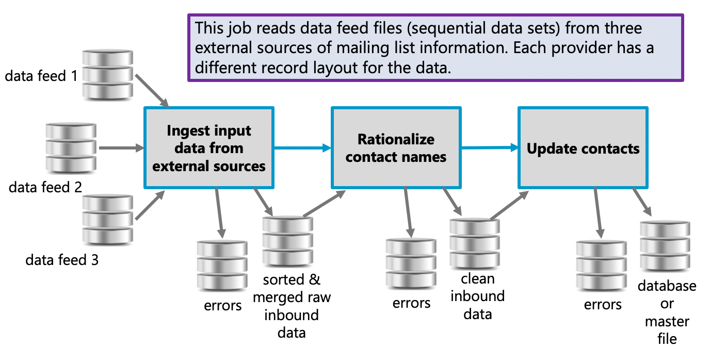
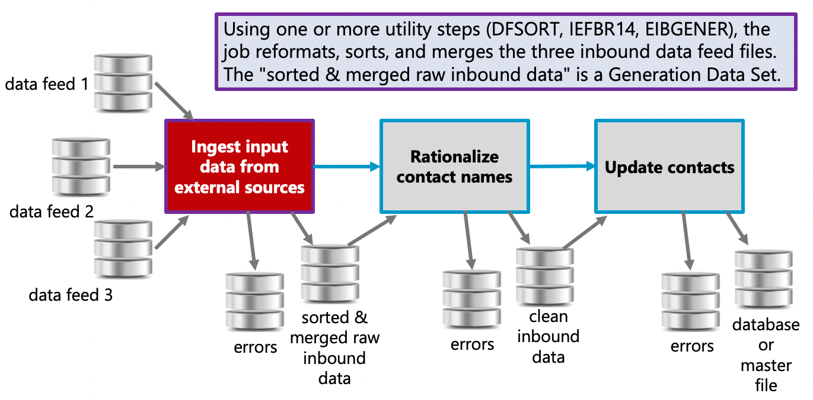

# z/OS Training 

## Capstone Projects 

### 1. Mass-Mailing Solution 

#### Back Story

Our company, a revered financial institution, sends unsolicited emails to unsuspecting people to advertise unwanted products.

It is a time-honored business model that everyone loves.

#### Application Overview 

We purchase mailing lists from three external suppliers, who send us sequential data sets we call _data feeds_
. 
We run a batch job that performs extract-transform-load (ETL) operations on the data feeds to produce a single sequential data set that contains contact information in a common format.

The job then processes that data set to update our system of record with new contacts and to set a "do not contact" indicator if requested.

Another batch job runs on a monthly basis. It looks for contacts in the system of record who have not received a mailing within the past month. If their "do not contact" indicator is not set, they are selected for the next mailing.

The next step in the job reads the selected contact records and sends the emails with fake "from" addresses, to foil blocklists.

Our customer service department uses a CICS application to browse the Contacts. Just like a real customer service department, they can't change anything in the system.

#### Skills to Demonstrate

The project offers the opportunity to demonstrate the following skills:

- Using ISPF panels to allocate data sets.
- Using SDSF to review batch job output.
- Writing JCL to run IBM utilities such as IEFBR14, EIBGENER, DFSORT, and IDCAMS.
- Writing DFSORT commands to reformat, sort, and merge data sets.
- Working with Generation Data Groups (GDGs).
- Conditional job step execution using either COND or IF/ELSE.
- Step restart after job failure, including handling Generation Data Sets correctly.
- Writing batch COBOL programs that access either DB2 or a VSAM KSDS, as well as sequential data sets.
- Writing COBOL logic to manipulate textual data and perform date arithmetic.
- Designing and coding a BMS mapset (full bootcamp only).
- Writing a COBOL program to access either DB2 or VSAM in the CICS environment (full bootcamp only).

#### System of Record 

The system of record for our solution contains Contact information.

Depending on the topics included in your training program, this will be either a DB2 database containing one table or a single VSAM Key-Sequenced Data Set (not both).

The data store for the system of record is _not_ provided. Creating it is part of the capstone exercise.

_System of Record – VSAM KSDS_

Average and maximum record sizes: 219   219 

Key length and offset: 80   0

Record layout:

| Positions | Field | Description |
| --- | --- | --- |
| 1-40  | Email-Address | Email address (RID) |
| 41-80 | Surname       | English: Last name, Spanish: Primer Apellido (RID) |
| 81-120 | First-Name  | English: First name, Spanish: Primer Nombre |
| 121-160 | Middle-Name | English: Middle name, Spanish: Segundo Nombre |
| 161-200 |	Additional-Name | English: spaces, Spanish: Segundo Apellido |
| 201-202 |	Language | EN or ES | 
| 203-210 |	Last-Contact | YYYYMMDD |
| 211-218 |	Last-Response | YYYYMMDD |
| 219-219 |	Do-Not-Contact | "X" or "P" or space |

_System of Record - DB2_

Table Name: **CONTACTS** 

| Column    | Type        | Notes       | Description |
| ---       | ---         | ---         | --- |
| ID        |             | primary key | System generated |
| LANG      | CHARACTER(2)| not null    | "EN" or "ES" |
| SURNAME   | VARCHAR(30) | not null    | English: Last Name, Spanish: Primer Apellido |
| FIRST_NAME | VARCHAR(30) | not null   | English: First Name, Spanish: Primer Nombre |
| MIDDLE_NAME | VARCHAR(30) | null      | English: Middle Name, Spanish: Segundo Nombre |
| ADDL_NAME | VARCHAR(30) | null        | English: N/A, Spanish: Segundo Apellido |
| EMAIL_ADDR | VARCHAR(40) | not null   | Email address |
| LAST_CONTACT | DATE | null     | Date of latest mailout | 
| LAST_RESPONSE | DATE | null | Date of latest response |
| DO_NOT_CONTACT | CHARACTER(1) | null | "X" do not send, "P" pending request, or null |

#### Batch Job #1 - Ingest Data Feeds 

The first batch job will comprise several steps to read data feeds in different formats, reformat them into a common format, normalize the names, sort the records and merge the files before updating the system of record with new and modified contact information. The number of job steps will depend on how you choose to design the solution. 

The first three steps of the job must read the three data feeds and sort them. 

_Data Feed #1_ 

Data set type: PS (sequential)

Logical record length: 133 

Record format: Fixed, blocked 

Record layout:

| Positions | Contents |
| ---       | ---      |
| 1 - 100   | Name - comma-delimited list of tokens. May contain: |
| |              first-name, last-name |
| |              first-name, middle-name, last-name |
| |              primer-nombre, segundo-nombre, primer-apellido, segundo-apellido | 
| |              if blank, it's an error | 
| |              if it contains fewer than 2 tokens or more than 4 tokens, it's an error |
| 101 - 132 | Email Address - could be invalid |
| 133 - 133 | Do Not Contact requested - any non-blank value | 

  This format contains no language indicator. Normalization logic must guess based on the number of tokens in the Name field 

